# Kal Corwin
*EFY, Computer Science Intent | Aspiring Game Developer*

# Homebound

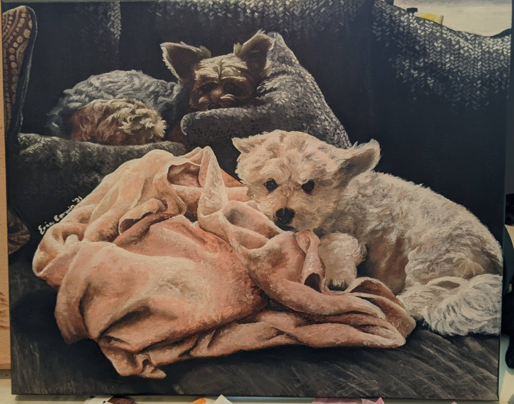

Medium: Acrylic Paint on Canvas
* **Dimensions:** 20" x 16"
* **Year Completed:** 2021

# Softwave Glamour

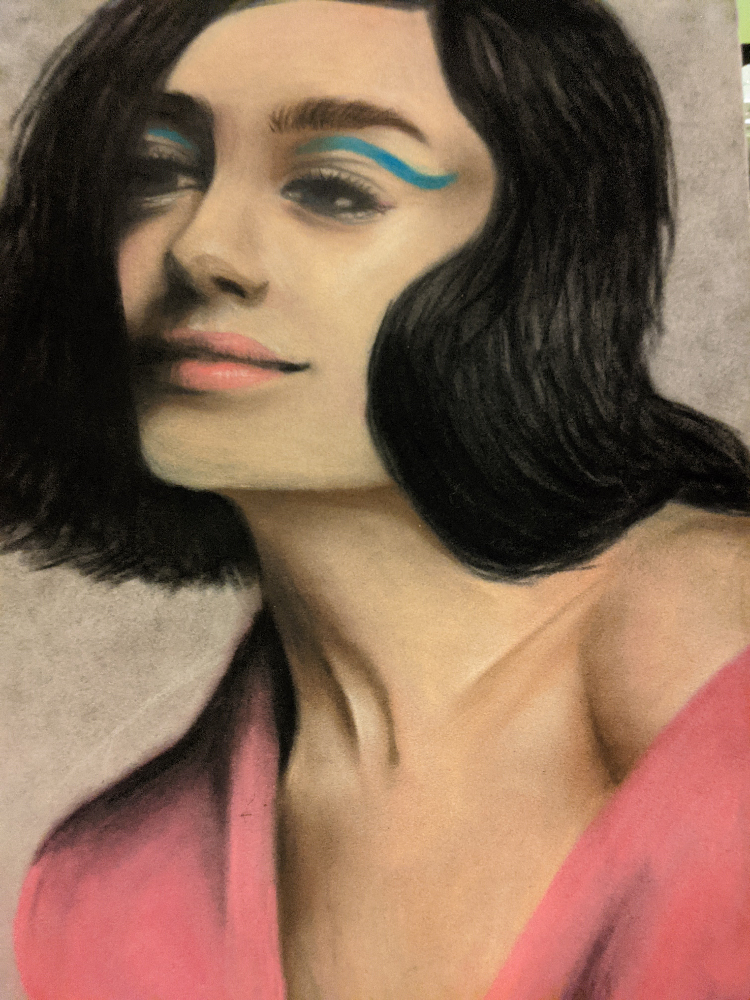

Medium: Soft Pastel on Velour Paper
* **Dimensions:** 9.4" x 12.6"
* **Year Completed:** 2020

# C'est la Vie

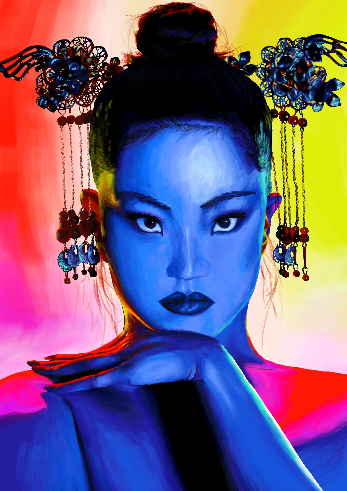

Medium: Digital, Created on Krita
* **Dimensions:** 2,480 x 3,508 pixels
* **Year Completed:** 2022

# Little Creatures

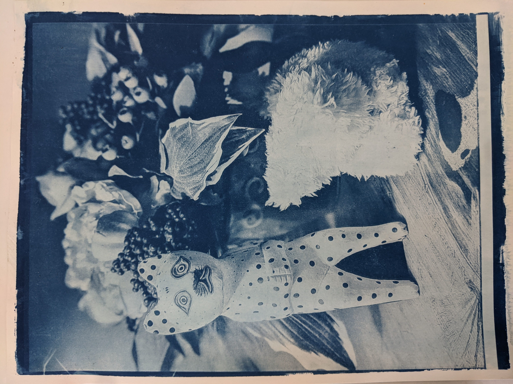

Medium: Cyanotype on Watercolor Paper
* **Dimensions:** 9" x 12"
* **Year Completed:** 2021

# Hollowed Out

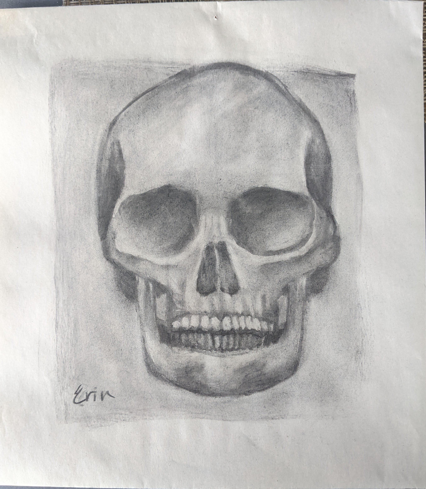

Medium: Charcoal on Newsprint Paper
* **Dimensions:** 11.4" x 12.5"
* **Year Completed:** 2019

# To Copy, To Create

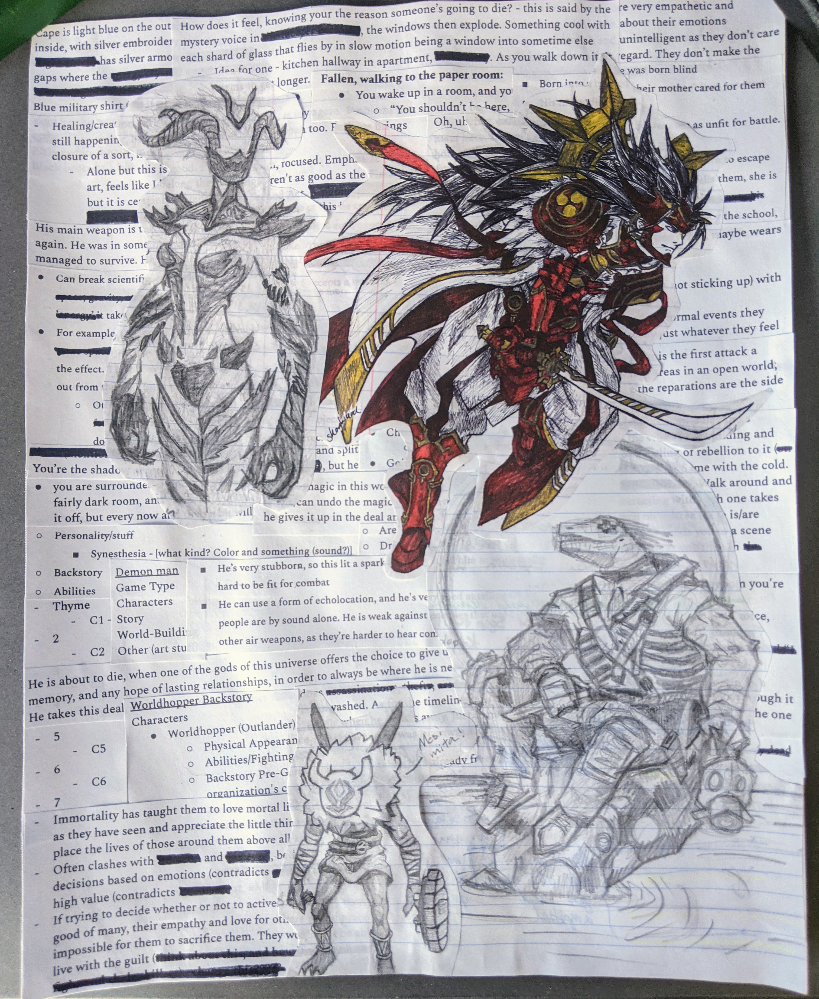

Medium: Collage, Pen and Pencil on Paper
* **Dimensions:** 11" x 14"
* **Year Completed:** 2021

# A Fall

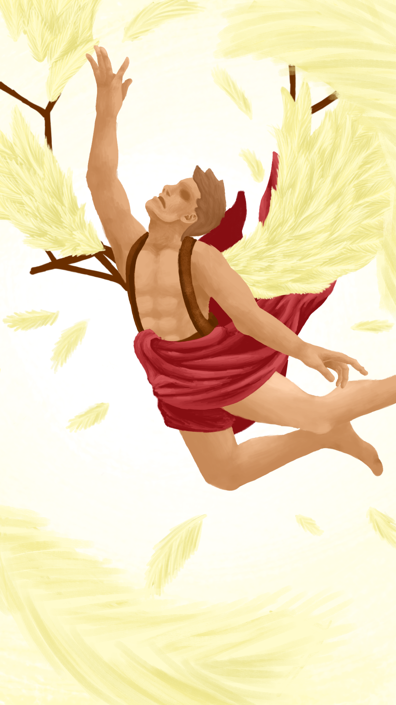

Medium: Digital, Created on Krita
* **Dimensions:** 1,080 x 1,920 pixels
* **Year Completed:** 2020

# Familiar Spaces

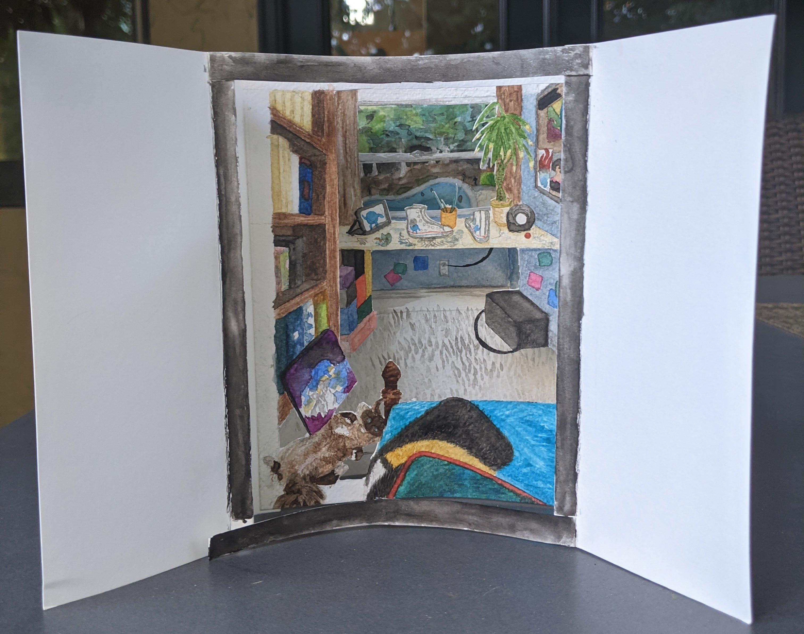
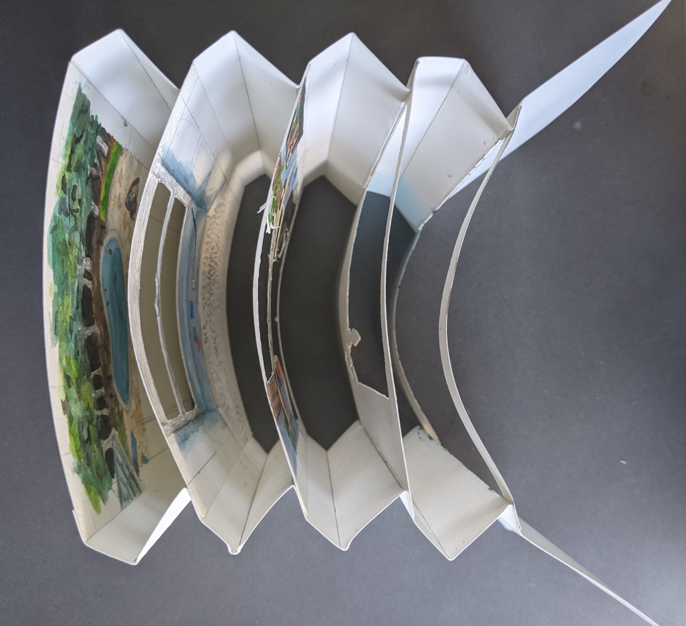

Medium: Watercolor on Watercolor Paper
* **Dimensions:** 6" x 6.75" x 8.5"
* **Year Completed:** 2021

# Life's Gauntlet

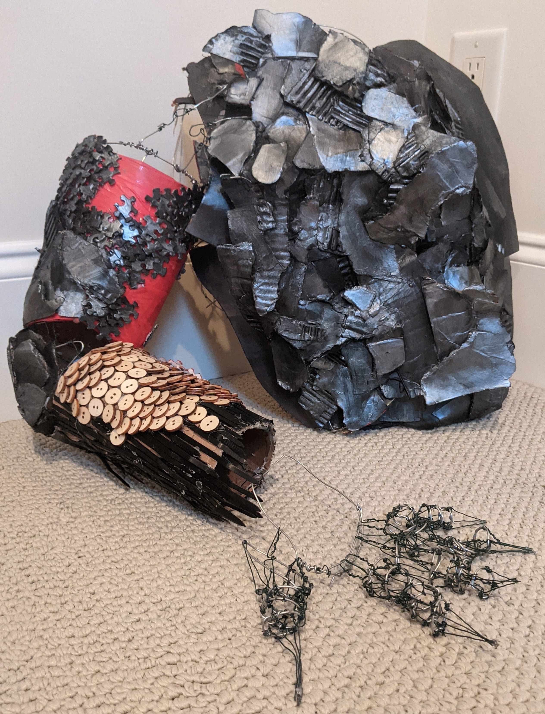
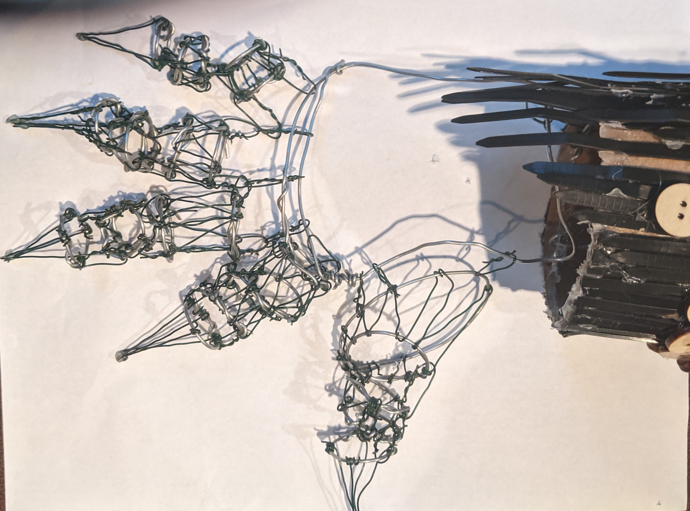

Medium: Mixed Media (Wire, Cardboard, Found Objects, Acrylic Paint)
* **Dimensions:** 20.75" x 14.5" x 14.5"
* **Year Completed:** 2021

# A Night on the Town

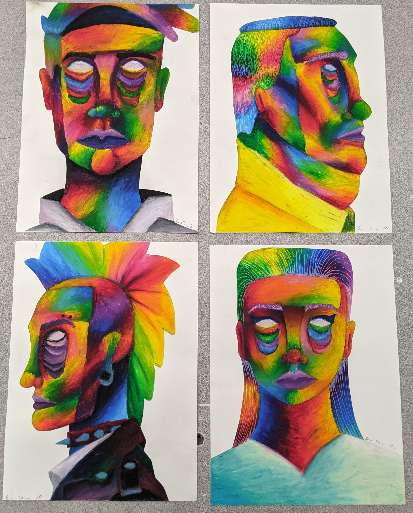

Medium: Oil Pastel on Paper
* **Dimensions:** 19" x 25"
* **Year Completed:** 2020
